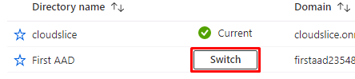

## Crear Tenant

1. Inicie sesión en Azure Portal +++https://portal.azure.com/?l=es.es-es+++ con las siguientes credenciales:

    |||
    |--|--|
    |Nombre de usuario|+++@lab.CloudPortalCredential(LabUser).Username+++|
    |Contraseña|+++@lab.CloudPortalCredential(LabUser).Password+++|

1. Busque y seleccione +++**Microsoft Entra ID**+++

1. En la hoja de información general de Microsoft Entra ID, seleccione **Administrar inquilinos** y luego **+ Crear**.

1. En la pestaña Básico de la hoja Crear un directorio, seleccione **Microsoft Entra ID** y luego **Siguiente: Configuración**.

1. En la pestaña Configuración, configure los siguientes campos y haga clic en **Revisión y creación** y seleccione **Crear**:

    |||
    |--|--|
    |Nombre de la organización|+++First AAD+++|
    |Nombre de dominio inicial|+++firstaad@lab.LabInstance.Id+++|
    |País o región|Estados Unidos|

    > [!ALERT] Espere a que la creación del directorio se complete. Esto podría tomar unos minutos.
    >
    > Si encuentra una solicitud de captcha durante la creación, tenga en cuenta que aunque el formulario de captcha pueda fallar, aún podría crearse el inquilino. Por favor, verifique la sección de gestión de inquilinos antes de intentar nuevamente el proceso de creación de inquilinos. Hemos escalado el problema con Microsoft para obtener ayuda.

1. Cuando se haya terminado de crear el directorio, actualice la ventana del explorador para comprobar que la operación se creación se completó correctamente.

1. En la barra de herramientas de la parte superior de Azure Portal, seleccione el icono **Cambiar directorio**.

    

1. En el cuadro de diálogo **Cambiar inquilino**, junto al directorio **First AAD**, seleccione **Cambiar**.

    

1. Debido a los requisitos de **Multi-Factor Authentication (MFA)** que está implementando Microsoft, es posible que deba autenticarse con una aplicación de autenticación al acceder al inquilino recién creado. Actualmente, esto solo afecta a los laboratorios que requieren que los alumnos creen un nuevo inquilino en Azure.

1. Haga clic en Siguiente para proceder al laboratorio.
