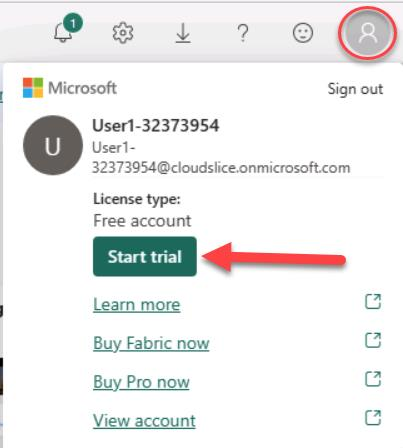

# Avant de commencer

> **Conseil**: Pendant que vous suivez les instructions dans cette fenêtre, chaque fois que vous voyez une icône +++icône+++, vous pouvez l'utiliser pour copier du texte de la fenêtre d'instructions dans l'interface de la machine virtuelle. C'est particulièrement utile pour copier du code ; mais veuillez noter que vous devrez peut-être modifier le code collé pour corriger les niveaux de retrait ou le formatage avant de l'exécuter.

## Connexion à Windows

1. Dans la machine virtuelle, connectez-vous à Windows en utilisant les informations d'identification suivantes :

    - **Nom d'utilisateur** : +++@lab.VirtualMachine(Win11-CL-01).Username+++
    - **Mot de passe** : +++@lab.VirtualMachine(Win11-CL-01).Password+++

## Créer un compte Power BI gratuit

1. Dans la machine virtuelle, ouvrez un navigateur web et accédez à +++https://app.fabric.microsoft.com+++.

2. Lorsque vous y êtes invité, connectez-vous en utilisant les informations d'identification suivantes :

    - **E-mail** : +++@lab.CloudPortalCredential(User1).Username+++
    - **Mot de passe** : +++@lab.CloudPortalCredential(User1).Password+++

3. Terminez le processus d'inscription pour créer un nouveau compte, en entrant le numéro de téléphone +++555 1234567+++ lorsqu'on vous le demande.

## Activer un essai Fabric

1. Après vous être inscrit pour un compte Power BI gratuit, dans le portail Power BI à +++https://app.fabric.microsoft.com+++, sélectionnez l'icône **Gestionnaire de compte** (l'image de l'utilisateur en haut à droite) et dans le menu, sélectionnez **Commencer l'essai** pour démarrer un essai Microsoft Fabric.

    

2. Une fois l'essai démarré, vous pouvez fermer le navigateur - souvenez-vous simplement de l'**adresse e-mail** et du **mot de passe** que vous avez utilisés pour vous inscrire à Power BI, vous en aurez besoin dans l'exercice.

Vous êtes maintenant prêt à commencer l'exercice sur la page suivante, en utilisant la licence d'essai de Fabric que vous venez de créer.
