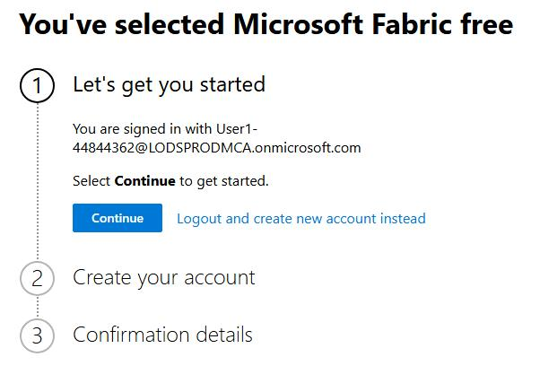

## 無料の Power BI アカウントを作成する

1. 仮想マシンで Web ブラウザーを開き、+++https://app.fabric.microsoft.com+++ にアクセスします。

1. サインインを求められたら、次の資格情報を使用してください：

    - **メール**: +++@lab.CloudPortalCredential(User1).Username+++
    - **パスワード**: +++@lab.CloudPortalCredential(User1).Password+++

1. **サインインを続けますか？** ダイアログで **はい** を選択し、**Bing や Outlook などの Microsoft サイトに自動的にサインインしますか？** では **いいえ** をクリックします。

1. アカウントのプロビジョニング中に Power BI のアイコンが表示されます。このページが完了するまで、ページを更新したり他のページに移動したりしないでください。この処理には 5 分以上かかる場合があります：

    

1. プロビジョニングが完了すると次の画面が表示されるので、**続行** をクリックします：

    

1. **アカウントを作成する** ページで電話番号の入力を求められた場合、+++555 1234567+++ と入力し、**はじめる** をクリックします。

1. 確認詳細ページで **はじめる** を再度クリックします。

1. 環境の準備が整う間、再び Power BI のアイコンが表示されます。この間も、ページを更新したり、別のページに移動したりしないでください。これも 5 分以上かかることがあります。

## Fabric トライアルを有効化する

1. 無料の Power BI アカウントにサインアップした後、Power BI ポータル +++https://app.fabric.microsoft.com+++ で、**アカウント マネージャー** アイコン（右上の *ユーザー* 画像）を選択し、メニューから **無料トライアル** を選択して Microsoft Fabric トライアルを開始します。

1. **有効化** をクリックします。

1. **Microsoft Fabric へのアップグレードが成功しました** というダイアログが表示されたら、**現在のページにとどまる** を選択します。

1. トライアルが開始された後、ブラウザーを閉じることができます。ただし、Power BI のサインアップに使用した **メール** と **パスワード** を覚えておいてください。演習で必要になります。

> [!alert] **Fabric** ラボの問題により、少なくとも **5 分間** 待ってからラボの手順に進んでください。

これで、作成した Fabric トライアル ライセンスを使用して、次のページで演習を開始する準備が整いました。
